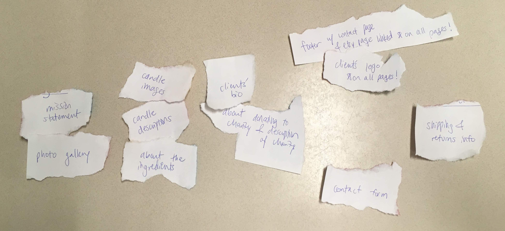
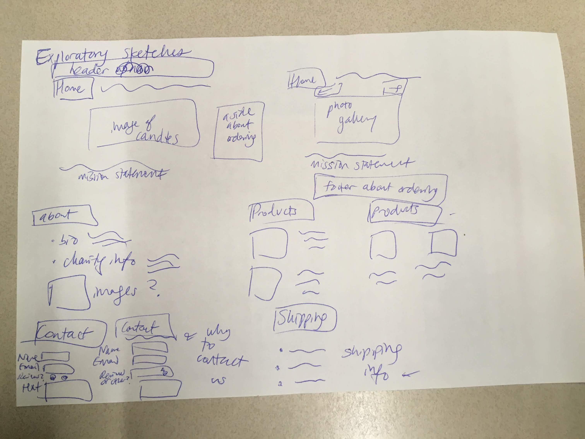
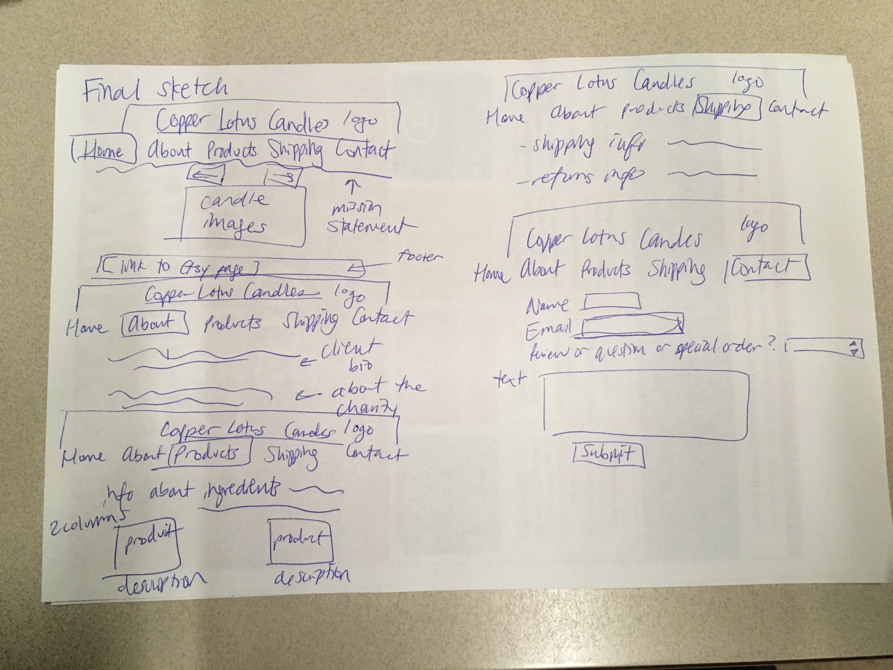

# Project 4 - Design & Plan

Your Team Name: Red Lion

## Milestone 1: Design your Client's Site

### Client Selection (Milestone 1)

#### Client Description

[Tell us about your client. Who is your client? What kind of website do they want? What are their key goals?]

[NOTE: If you are redesigning an existing website, give us the current URL and some screenshots of the current site. Tell us how you plan to update the site in a significant way that meets the Project 4 requirements.]

Our client is a Cornell Hotel School student with one semester left to go. She has been spending a lot of her free time working on this candle business that is inspired by her love of food and making things for other people. She wants to effectively market her business, showcase her values, and  attract people to become return customers. She wants to a portion of her profits to charity once her business is up and running.

### Client Needs & Wants/Requirements (Milestone 1)

#### Purpose & Content

[Tell us the purpose of the website and what it is all about.]

The purpose of the website is to market her candle business effectively, and to draw in customers both with the quality of the products and also by her values (ethical sourcing of ingredients, female entrepreneurship, and donation of a portion of profits to charity). She wants to tell customers about own story, information about the sourcing of her ingredients, information about the products, and wants the customers to be able to contact her through the webpage.

#### Client Needs and Wants

[Collect your client's needs and wants for the website. Come up with several appropriate design ideas on how those needs may be met. In the **Memo** field, justify your ideas and add any additional comments you have. There is no specific number of needs required for this, but you need enough to do the job.]

Example:
- Needs/Wants #1
  - **Needs and Wants** [What does your client and audience need and want?]
    - - Client wants to communicate her brand and its ethics/values to customers.
  - **Design Ideas and Choices** [How will you meet those needs and wants?]
    - We will include information on her sourcing of ingredients, her donating profits to charity, and on her own story as an entrepreneur.
  - **Memo** [Justify your decisions; additional notes.]
    -N/A

- Needs/Wants #2
  - **Needs and Wants** [What does your client and audience need and want?]
      - Client wants to ensure that customers understand what kinds of products to expect from her and are able to put in special orders and ask questions.
  - **Design Ideas and Choices** [How will you meet those needs and wants?]
      -We will include detailed product information on the webpage so that the customers understand what kind of products to expect from her, and we will collect reviews through a contact form that can be used in the future to demonstrate the quality of her products. The contact form will also allow for special orders and questions to get to the client from the audience. The contact form will be linked in the footer on every page.  
  - **Memo** [Justify your decisions; additional notes.]
      -N/A

- Needs/Wants #3
    - **Needs and Wants** [What does your client and audience need and want?]
        - Client wants to customers to be able to easily purchase products.
    - **Design Ideas and Choices** [How will you meet those needs and wants?]
        - We will have specific links to the Etsy page where customers can purchase each of her products on the products page of our website (this will be included in the descriptions below each product) and there will be an footer on every page that links to her online store as well.
    - **Memo** [Justify your decisions; additional notes.]
        -N/A

#### Client Meeting Notes

[By this point, you have met once with your client to discuss all their requirements. Include your notes from the meeting, an email they sent you, or whatever you used to keep track of what was discussed at the meeting. Include these artifacts here.]

typed notes from the meeting:

-needs and wants: to communicate her brand, basically what it stands for, the ethics/values, as well as what products customers can expect from her
-website should also provide a way for customers to purchase products
-target audience: younger moms, usually know a decent amount about candles, usually have significant disposable income (value but not in sense of Walmart or Target value), really emphasize product safety (soy wax, American manufacturer, sturdy glass jar) to convey kids won’t get hurt  
-since candles are very seasonal, having a what’s next page might be nice (to generate buzz or excitement, like a coming soon), but should wait until spring to code this up
-expect people to look for how stuff is sourced, what ingredients are in it, we can make the world a little brighter (profits going to certain social orgs)
-return customer returns for company values, not product
-for interactivity: interactive photo gallery (product showcase, talking about the smell, sizes they come in) user form (special order, request, question) then scroll to interactive reviews
-review section for each product as part of interactive gallery
-shipping and returns information necessary
-want products page not to have too much info on it so it isn't too overwhelming; have the about page contain most ethical info, ingredients is OK on products page (focus on minimalism and not making things overwhelming)

### Target Audience (Milestone 1)

#### Target Audience(s)

[Tell us about the specific audience(s) for this website.]

The target audience for the webpage, according to our client, is younger moms that know a fair amount about candles already. They usually have significant disposable income and are concerned about durability and safety of the products, as well as the ethics of the business.

#### Target Audience Needs

[What are the needs of your target audience(s)? Note that these are probably *not* the needs of your client.]

--Candles that are safe to use around kids
--To support an ethical business over another business (webpage clearly conveys ethics of business)
--Candles that are high quality
--Easy-to-use webpage, easy-to-order candles

### Initial Design (Milestone 1)

#### Content

[Place your content in the **content** folder. NOT in the documents folder.]

[Note any content (e.g., text, image) that you need to make/get from the client here.]

-business logo
-her bio
-candle pictures and descriptions
-link to her Etsy webpage
-information about product sourcing
-information about charities to donate to
-shipping and returns info

#### Content Organization, Information Architecture, and Navigation

[Lay out the plan for how you'll organize the site and which content will go where. Plan out the navigation for the site. Document your process for organizing the content.]

[Note: As with the Needs and Wants table, there is no specific amount to write here. You simply need enough content to do the job.]

- **Navigation**
  - Home
  - About
  - Our Products
  - Shipping and Returns
  - Contact

- **Content** (List all the content corresponding to main navigation and sub-categories.)
  -All pages will have the same footer that links to the Etsy shop and Contact page.
  - *Home*: Photo gallery with next and back buttons, along with the mission statement.
  - *Our Products*: List of every product, with pictures and information on what they are. Blurb about ingredients and their quality at the top.
  - *About*: Client bio- her origins and ethics. Emphasis on American made, kid friendly products to appeal towards younger mothers. Information about the charity that the client is giving profits to.
  - *Shipping and Returns*: Display shipping and return information as provided by the client.
  - *Contact*: Contact page will include an interactive special order/request form, with spaces for email, and the request. The contact form is also for customers to leave reviews.

- **Process**
  -
  - The website user should first be directed to the home page, to obtain a general sense of what the website is about. The user should be able to see images of what the client is selling. In addition to these images, the user will be able to read text giving a short introduction to the store's values and appeal.
  After the user has seen a general sense of direction, they will now either click the Products page, or head towards About to find more about the client, the client's ethics and values. Both products and client information are prioritized.
  The Shipping and Returns section will most likely be used by users who have already accessed Our Products and/or About Us. It will detail future ideas for those who are already interested.
  The last tab will be Contact, and the user will most likely go to this page last, or if they have a specific question or request, and want to look for this section in particular.
  Our navigation bar is designed to be on the top of the page, running horizontally for easy visual access.

#### Sketches

[Include exploratory idea sketches of your website.]

[Include sketches of your finalized design.]

#### Interactivity

[What interactive features will your site have? Describe how the interactivity connects with the needs of the clients/target audience.]

    1. A contact us form for questions or special orders and reviews. This will allow the client to hear from her customers and allow customers to contact our client, which is a need for both parties.
    2. A picture gallery of her products that the customers can scroll through. This is one way for the customers to see all the products and interact with the website and also allows our client to showcase her products in a way that prompts her customers to focus on each product one by one instead of being overwhelmed by a big list of them.
    3. A dropdown on the products page that links to where each product is on the page. This will make it easier for someone to quickly find a specific candle. This meets the need to be able to easily use the website and find candles to order easily.

#### Additional Comments (Milestone 1)

[If you feel like you haven't fully explained your design choices, or if you want to explain some other functions in your site (such as special design decisions that might not meet the Project 4 requirements), you can use this space to justify your design choices or ask other questions about the project and process.]
N/A

## Milestone 2: Draft of Coded Website

### Interactivity (Milestone 2)

[Write your interactivity pseudocode here. Remember you must use two conditional statements.]
Contact Form:
  If the name is empty contains characters that aren't letters:
      Show a feedback message, "Please enter your full name."
      Do not submit the form.
  Otherwise,
      Do not show feedback message.
      Submit form.
  If the email is empty or not a valid email:
      Show a feedback message, "Please enter a valid email."
      Do not submit the form.
  Otherwise,
      Do not show feedback message.
      Submit form.
  If the text area is empty:
      Show a feedback message, "Please enter your message."
      Do not submit the form.
  Otherwise,
      Do not show feedback message.
      Submit form.

Picture Gallery:
  If user clicks on the next button and is not on the last picture:
    Display next image.
  If user clicks on the next button and is on the last picture:
    Display the first image.
  If user clicks on the back button:
    Display previous image.
  If user clicks on the back button and is on the first picture:
      Display the last image.
  If user does not click on either button:
    Do not do anything.

Dropdown:
  If mouse is above the Products section of the nav bar:
      Display the list of all products that link to locations on the page.
  Otherwise,
      Do not do anything.

### Tasks (Milestone 2)

[You will need to come up with at least 4 tasks. List your tasks here. You *do not* have to do user tests yet.]

Task 1: You want to buy a new candle for the coming season. Navigate to the Etsy page to order a candle.

Task 2: You want to give a suggestion for a new variety of candle. Let the business owner know what you suggest.

Task 3: You are concerned about the safety of products for your children. Figure out whether the candles are safe for children.

Task 4: You want to ensure that the business has an ethical standpoint. Figure out what the business' ethics and values are and describe how the business takes action on them.

### Client Meeting (Milestone 2)

[By this point, you have met once with your client a second time to discuss your initial design. Include your notes from the meeting, an email they sent you, or whatever you used to keep track of what was discussed at the meeting. Write a few sentences about the design feedback you received from your client.]

The client suggested instead of using a colored header, we could incorporate her logo into the header. She also suggested that we change the color scheme to a blue that matches her logo better. Content wise, she didn't have any feedback to give. She suggested mostly that we just improve our visual design by making the website take on a stronger visual theme to bring it together, by using color and incorporating her logo.

### Additional Comments (Milestone 2)

[If you feel like you haven't fully explained your design choices, or if you want to explain some other functions in your site (such as special design decisions that might not meet the Project 4 requirements), you can use this space to justify your design choices or ask other questions about the project and process.]
N/A

## Milestone 3: Presentation & Demo Ready Draft

### Additional Comments (Milestone 3)

[If you feel like you haven't fully explained your design choices, or if you want to explain some other functions in your site (such as special design decisions that might not meet the Project 4 requirements), you can use this space to justify your design choices or ask other questions about the project and process.]
N/A

## Final Submission: Complete, Polished, and User Tested Website

### Changes Based on Presentation (Final Submission)

[What changes did you make to your plan or design based on your peers' feedback?]

Our peers suggested that we:
  -emphasize the two distinct sections on the about page visually, because it all looks like one thing (now we have headers to distinguish them easily)
  -add a back button to the photo gallery on the homepage

### User Testing (Final Submission)

#### Participant 1

1. Who is your participant, e.g., what is their name, where do they comes from, what is their job, characteristics, etc.?

 My participant is Ana Adinolfi. Ana works in Cornell Career Services, and has a partner, and toddler son. She loves to use candles throughout the year and is interested in having her money go to good causes.

2. Does your participant belong to your target audience of the site? (Yes / No)

[If “No”, what’s your strategy of associating the user test results to your target audience’s needs and wants? How can your re-design choices based on the user tests make a better fit for the target audience?]

Yes.

[Report the results for your user's performance on each of your tasks. You should **describe the task** you ask the user to complete, explain **what the user did**, describe the user's **reaction/feedback** to the design, **reflect on the user's performance**, determine what **re-design choices** you will make. You can also add any additional comments in the **memo** field.]

  - Task #1
    - **Task Description** (What was the task for this user?)
      -You want to buy a new candle for the coming season. Navigate to the Etsy page to order a candle.
    - **How did the user do? Did that meet your expectation?**
      - The user quickly navigated to the products page and clicked on the Etsy link, which is what we expected.
    - **User’s reaction / feedback to the design** (e.g., specific problems or issues found in the tasks)
      - The user mentioned that the Etsy page was incomplete (the client is actually working on it now), so that if she were to try and order a candle on Etsy she couldn't.
    - **Your reflections about the user’s performance to the task**
      - Quick and easy, user did very well.
    - **Re-design choices**
      -None, no issues arose
    - **Memo** (Justify your decisions; additional notes.)
        -N/A

  - Task #2
    - **Task Description** (What was the task for this user?)
      -You want to give a suggestion for a new variety of candle. Let the business owner know what you suggest.
    - **How did the user do? Did that meet your expectation?**
      - The user quickly navigated to the Contact form, then hesitated before selecting
      the second option. This was what we expected.
    - **User’s reaction / feedback to the design** (e.g., specific problems or issues found in the tasks)
      - The user said that she wasn't sure whether to click on "Send in a question or comment" or "Post a review," because a new candle variety could be a variation on an old one.
    - **Your reflections about the user’s performance to the task**
      - The user brought up the fact that it might be hard to differentiate between the two radio buttons for this reason, because a comment or question might be on the subject of a specific product. The client specifically asked for this distinction, though, so we will not redesign, but will inform the client that this confusion arose.
    - **Re-design choices**
      - N/A (see above rationale!)
    - **Memo** (Justify your decisions; additional notes.)
      - N/A

  - Task #3
    - **Task Description** (What was the task for this user?)
      -You are concerned about the safety of products for your children. Figure out whether the candles are safe for children.
    - **How did the user do? Did that meet your expectation?**
      - The user didn't know where to look at first, she hesitated before clicking on the Products page and finding the information about safety for children, which is ultimately the outcome we expected.
    - **User’s reaction / feedback to the design** (e.g., specific problems or issues found in the tasks)
      - The user said that she usually actually never worries about safety of candles because she deliberately keeps them out of reach of her kids, but was pleasantly surprised to see the client's committmment to safety, based on the ingredient descriptions that implied safety.
    - **Your reflections about the user’s performance to the task**
      - No issues at all, just reinforced our current content and design.
    - **Re-design choices**
      - N/A, no issues arose
    - **Memo** (Justify your decisions; additional notes.)
      -N/A

  - Task #4
    - **Task Description** (What was the task for this user?)
      -You want to ensure that the business has an ethical standpoint. Figure out what the business' ethics and values are and describe how the business takes action on them.
    - **How did the user do? Did that meet your expectation?**
      - The user quickly navigated to the about page and read both sections, and explained how they answer the task, which is what we expected.
    - **User’s reaction / feedback to the design** (e.g., specific problems or issues found in the tasks)
      - The user was impressed about the business' ethics which was really encouraging!
    - **Your reflections about the user’s performance to the task**
      - Good, no issues, which was encouraging.
    - **Re-design choices**
      - N/A, no issues came up
    - **Memo** (Justify your decisions; additional notes.)
      -N/A

#### Participant 2

1. Who is your participant, e.g., what is their name, where do they comes from, what is their job, characteristics, etc.?

Our second participant works as a therapist at Gannett. Her name is Sheila, and she has 2 kids under the age of 5. She doesn't regularly use candles because she is worried about using them around kids.

2. Does your participant belong to your target audience of the site? (Yes / No)

[If “No”, what’s your strategy of associating the user test results to your target audience’s needs and wants? How can your re-design choices based on the user tests make a better fit for the target audience?]

Yes.

- Task #1
  - **Task Description** (What was the task for this user?)
    - You want to buy a new candle for the coming season. Navigate to the Etsy page to order a candle.
  - **How did the user do? Did that meet your expectation?**
    - She quickly found the Etsy link in the footer, and didn't even need to navigate to the Products page, which was more than we expected.
  - **User’s reaction / feedback to the design** (e.g., specific problems or issues found in the tasks)
    - User said it was easy and she liked the footer design!
  - **Your reflections about the user’s performance to the task**
    - No issues at all.
  - **Re-design choices**
    - N/A, because there were no issues
  - **Memo** (Justify your decisions; additional notes.)
    - N/A

- Task #2
  - **Task Description** (What was the task for this user?)
    - You want to give a suggestion for a new variety of candle. Let the business owner know what you suggest.
  - **How did the user do? Did that meet your expectation?**
    - The user clicked on the Contact form from the footer that she had already read in the first task. She clicked the second radio button to leave a question or comment and suggested "Lavender." This is what we expected!
  - **User’s reaction / feedback to the design** (e.g., specific problems or issues found in the tasks)
    - User accidentally typed in her email wrong the first time, and the validation helped her catch that! Otherwise, nothing else came up.
  - **Your reflections about the user’s performance to the task**
    - It was encouraging to see that there were no issues.
  - **Re-design choices**
    - N/A, because no issues arose
  - **Memo** (Justify your decisions; additional notes.)
    - N/A

- Task #3
  - **Task Description** (What was the task for this user?)
    -You are concerned about the safety of products for your children. Figure out whether the candles are safe for children.
  - **How did the user do? Did that meet your expectation?**
    - The user wasn't sure which page to go to at first. We expected the user to navigate to the About page.
  - **User’s reaction / feedback to the design** (e.g., specific problems or issues found in the tasks)
    - The user thought this could be on the Products or the About page.
  - **Your reflections about the user’s performance to the task**
    - This outcome was surprising because we of course thought the webpage was easy to navigate. This is why we need to user test!
  - **Re-design choices**
    -Our client asked for this sort of information to be on a page separate from products so the products page wouldn't be too overwhelming, so we decided to link the About page on the Products page so the user could get to this information easily and the clients wishes could be met.  
  - **Memo** (Justify your decisions; additional notes.)
    -N/A

- Task #4
  - **Task Description** (What was the task for this user?)
    -You want to ensure that the business has an ethical standpoint. Figure out what the business' ethics and values are and describe how the business takes action on them.
  - **How did the user do? Did that meet your expectation?**
    - The user stayed on the About page and summarized the information on it, which met our expectation.
  - **User’s reaction / feedback to the design** (e.g., specific problems or issues found in the tasks)
    - The user was impressed by the business' ethics, and said she will consider buying a candle in the future!
  - **Your reflections about the user’s performance to the task**
    - This was also really encouraging!
  - **Re-design choices**
    - N/A, because no issues came up
  - **Memo** (Justify your decisions; additional notes.)
    - N/A

#### Participant 3

1. Who is your participant, e.g., what is their name, where do they comes from, what is their job, characteristics, etc.?

 My participant is Rhea Bansal. Rhea is a sophomore at Cornell University studying Computer Science. Rhea loves home decor and online shopping. She is interested in purchasing candles online.

2. Does your participant belong to your target audience of the site? (Yes / No)
No, according to our client the target audience is young mothers.

[If “No”, what’s your strategy of associating the user test results to your target audience’s needs and wants? How can your re-design choices based on the user tests make a better fit for the target audience?]

Although Rhea is not a mother, her opinion is still valuable as she is still a possible user of the website as she really enjoys home decor and online shopping. Some of our user test questions are more applicable for mothers, so we still used these questions on our other users to make the results of the user test applicable and a better fit for the target audience.

- Task #1
  - **Task Description** (What was the task for this user?)
    - You want to buy a new candle for the coming season. Navigate to the Etsy page to order a candle.
  - **How did the user do? Did that meet your expectation?**
    - Right away the user was able to click the link in the footer to navigate to the Etsy page
    - The user also clicked on the products page after to look at the candles on that page
    - She also saw how the footer was continued onto all of the pages so you can access the link no matter where you are on the website
  - **User’s reaction / feedback to the design** (e.g., specific problems or issues found in the tasks)
    - The user had no issues finding the link to the Etsy page
    - user suggested that on the products page including direct links with each candle to the esty page for that exact candle making it easy to order
  - **Your reflections about the user’s performance to the task**
    - The user did a really good job
    - The ease with which she completed the task suggests that the link to order candles is clear and easy to find
  - **Re-design choices**
    - I really like the users suggested to include direct link with each candle on the products page and think that is something that should be included, however the client does not have her entire Etsy page set up so that is not feasible at this time
    - Instead of directly linking to each candle on the products page, I added an additional link at the top of the page
  - **Memo** (Justify your decisions; additional notes.)
    - NO changes need to be made to the footer, as the link to the Etsy page was clear and easy to find.
    - I would like to add links on the products page, but that cannot be done right now due to the fact that the client has not set up the candles on her etsy page.

- Task #2
  - **Task Description** (What was the task for this user?)
    - You want to give a suggestion for a new variety of candle. Let the business owner know what you suggest.
  - **How did the user do? Did that meet your expectation?**
    - The user was able to quickly and easily navigate to the contact page.
    - Filled out the review with no issues
    - while filling out the form she realized that there was also a link in the footer to take you to the contact page.
  - **User’s reaction / feedback to the design** (e.g., specific problems or issues found in the tasks)
    - The user had no issues finding the contact page
    - user liked the fact that the contact page was linked in the footer on every page
  - **Your reflections about the user’s performance to the task**
    - The user did a really good job
    - The ease with which she completed the task suggests that the contact page is clear and easy to find and fill out
  - **Re-design choices**
    - No re-design needed
  - **Memo** (Justify your decisions; additional notes.)
    - No changes were made to the contact page of the website as the user was able to quickly and easily complete the task with no difficulties.

- Task #3
  - **Task Description** (What was the task for this user?)
    - You are concerned about the safety of products for your children. Figure out whether the candles are safe for children.
  - **How did the user do? Did that meet your expectation?**
    - The user first read the quote on the top of the page and noted that the quote says the candles are safe
    - She then navigated to the about page and read the information on that page.
  - **User’s reaction / feedback to the design** (e.g., specific problems or issues found in the tasks)
    - The user found the quote on the top of the home page to be very helpful
    - She also thought the information on the about page was also very helpful in determining if the candles were safe
    - Thought the descriptions could be clearer about if they were safe for children
  - **Your reflections about the user’s performance to the task**
    - The user did a good job finding the quote on the home page and also navigating to the about page
    - The user never navigated to the products page which contains more information about the ingredients and safety
  - **Re-design choices**
    - In the about page I will include a link to the section of the products page that details the information about the ingredients and additional information about the safety
  - **Memo** (Justify your decisions; additional notes.)
    - Since it didn't occur to the user to look at the products page to find information about safety it makes sense to link to that section of the products page in the about page.
    - Also added another sentence in the about paragraph to include that the products are safe for children

- Task #4
  - **Task Description** (What was the task for this user?)
    - You want to ensure that the business has an ethical standpoint. Figure out what the business' ethics and values are and describe how the business takes action on them.
  - **How did the user do? Did that meet your expectation?**
    - The user first read the quote on the top of the page and noted that the quote says the candles are ethical and eco friendly
    - She then navigated to the about page and read the information on that page. She noted that the candle company contributes to non-profits and charities, specifically the Ithaca advocacy center
  - **User’s reaction / feedback to the design** (e.g., specific problems or issues found in the tasks)
    - The user found the quote on the top of the home page to be very helpful
    - She also thought the information on the about page was also very helpful in determining that the candles are created ethically and the business has very good values and donates to charity.
  - **Your reflections about the user’s performance to the task**
    - The user did a good job finding the quote on the home page and also navigating to the about page
    - The user was able to easily find the information about the business's ethics and values and clearly describe them
  - **Re-design choices**
    - no re-design
  - **Memo** (Justify your decisions; additional notes.)
    - The user was able to complete the task very easily and quickly suggesting that no re-design is necessary

### Changes Based on User Testing (Final Submission)

[What changes did you make to your plan or design based on user testing?]
- I added an additional link to the products page that links to the client's Etsy shop
- Added link in about paragraph to the section on products page to learn more about the Ingredients
- Added additional sentence in the about paragraph to more clearly include that the products are safe for children

### Final Notes to the Clients (Final Submission)

[Describe in some detail what the client will do (or would have to do) in order to make this website go live. What is the deployment plan?]

The cheap deployment plan is to first host the webpages on Heroku, which has a free plan for testing, and a paid plan for keeping the website up
24/7. However, since the client wants to have a personalized domain name, they will need to purchase their own domain name. They could do so buy
looking up domain name service websites, and hosting the webpages by following the instructions. Specific to the domain name, the form submit
page must also be changed to however the client wishes to receive form data.

[Include any other information that your client needs to know about your final website design. For example, what client wants or needs were unable to be realized in your final product? Why were you unable to meet those wants/needs?]

The client should know that we didn't get the contact form to successfully send to her email, which is something she wanted, to meet the need she had to communicate effectively through her website with customers. Otherwise, we effectively met all stated needs and wants to the best of our ability!

### Final Notes to the Graders (Final Submission)

[1. Give us three specific strengths of your site that sets it apart from the previous website of the client (if applicable) and/or from other websites. Think of this as your chance to argue for the things you did really well.]

We were able to incorporate a slideshow of pictures as the client wanted, and
set up a dropdown menu which takes users to the product they click on. We were also able to create a form which creates different option based on whether the user wants to post a review, or send a question, comment, or special order. We also made the page responsive, so that viewing the page on mobile would disable the dropdown menu, and elements in the page would shift accordingly. We also effectively incorporated her personal logo into the design!

[2. Tell us about things that don't work, what you wanted to implement, or what you would do if you keep working with the client in the future. Give justifications.]
We wanted to get

The client needs that we couldn't meet include getting a seasonal page set up to highlight seasonal candles. This is because the client didn't have time to get us that content, but we are willing to do this later! This would have helped try to get the users excited about buying her candles.

We also couldn't get a product reviews sections set up, because we didn't have the PHP knowledge for that. This would have helped meet the client need to sell her candles effectively by assuring customers that the products are high quality.

We also didn't get the form to send to her email, which would have allowed customers to contact her. Rishab worked on this and ran into difficulty getting the code to validate, but Piazza said it would be OK to not have this working for now. This is something we will be doing in the future for sure!

[3. Tell us anything else you need us to know for when we're looking at the project.]

The images kind of don't go with the overall theme, but we themed it around the logo that the client wanted included on the page! She said she'll send us new images when she has final ones for all of her products. Also, we were worried about there being too much whitespace or not enough content, but we did things this way because the client emphasized that she site shouldn't be too busy or overwhelming, and we used all content we were given.
