# Project 4: Design Journey

Your Team Name: navy cheetah

**All images must be visible in Markdown Preview. No credit will be provided for images in your repository that are not properly linked in Markdown. Assume all file paths are case sensitive!**


## Client Description

Our client is the president of Cornell YOURS. YOURS stands for Youth Outreach Undergraduates Reshaping Success. It is a volunteer program that works to mentor youth in Dryden, NY. He wants to build a website that serves both the organzations members, prospective members or anyone looking to learn more about this club. In particular he wants to showcase many photos to hightlight the experience mentors have with the children.

## Meeting Notes

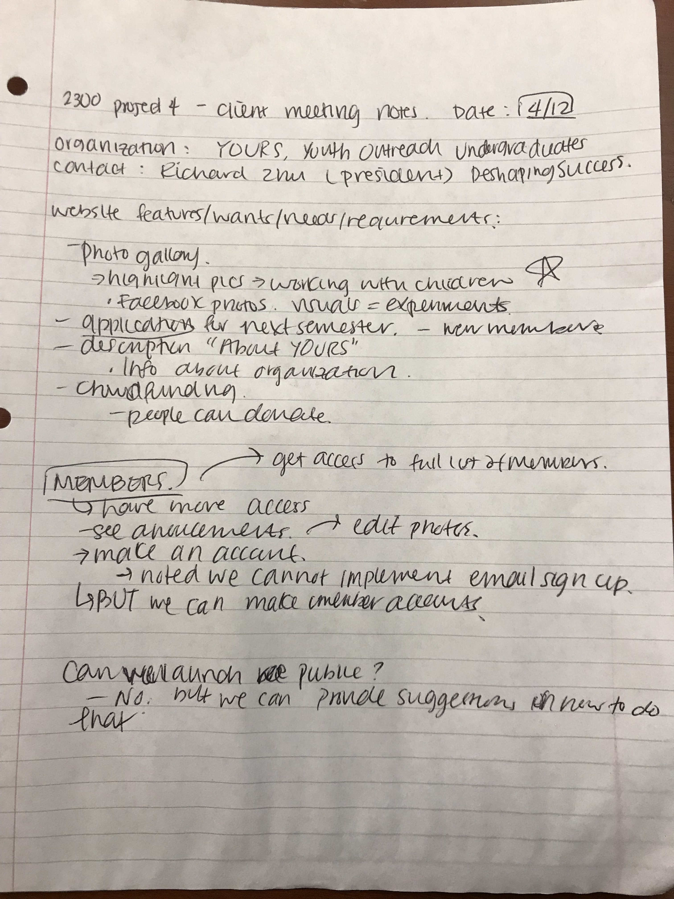


## Purpose & Content

The website is to showcase the work of the Y.O.U.R.S. group and act as an advocate for the group of people that they serve.

## Target Audience(s)

Our first target audience is current YOURS members. They can be able to took at the photo gallery and see pictures of themselves and other members with the kids they work with. They will also have the power and option to delete photos. Once a member is logged in, a delete feature for the photos will be available to them. The upload feature will also be available. Additionally, they can also use this website as a resources for club updates and check in on announcements.

Our second target audeince is potential YOURS members. Cornell students who might be interested in joining the club can learn more about the club by reading the description and looking through pictures of what joining the club entails. These potential memebers can interact with the website through the photo gallery as well as through the online application. They can apply to the club directly through the website application.

Our third target audience for this website are community activists who enjoy working with children. Many community members may want to keep updated on the work of the organization and see how they can contribute. Representative users could be students or adults living in the Ithaca area who are involved with local community outreach groups. They can interact with the website by looking through photos as well as donate to the cornell funding account.

## Client Requirements & Target Audiences' Needs

- Client Requirement
  - **Photo Gallery**
    - Client wants to show the photos taken at events that they put on throughout the school year.
  - **Design Ideas and Choices**
    - Create a photo gallery that is interactive; users should be able to click through each of the photos taken.
  - **Rationale**
    - This would allow the audience to look at all of the photos and see details about each photo as well.

- Target Audience Need
  - **Anouncements Page**
    - Users need to stay updated with what the organization is doing.
  - **Design Ideas and Choices**
    - Create a heading for announcements on the index page.
  - **Rationale**
    - This makes seeing the content convenient for the user because it will be on the home page.

- Client Requirement
  - **Crowdfunding link**
    - Client wants to advertise their crowdfunding campaign to get more people to sponsor their efforts.
  - **Design Ideas and Choices**
    - Create a heading for supporting their crowdfunding efforts on the index page.
  - **Rationale**
    - This makes seeing the content convenient for the user because it will be on the home page.

- Client Requirement
  - **Log-in and Log-out Functionality**
    - Client wants only organization members to be able to delete and add photos to the gallery.
  - **Design Ideas and Choices**
    - Create a login and log out form and include it on the gallery page.
  - **Rationale**
    - We plan to put the form on the gallery page because users will only need to be logged in to see different content on that page (to delete the picture or upload a picture)

- Client Requirement
  - **Mentor Application**
    - Client wants users to be able to apply to be a mentor through the website.
  - **Design Ideas and Choices**
    - Create a web-page with a form for users to be able to apply to be a mentor.
  - **Rationale**
    - This makes the application process much easier for the audience, and also the organization will not have to explain mentor membership to their audience as much (all details will be online).

- Target Audience Need
  - **View single image**
    - Users want to be able to view images and understand the context behind each picture
  - **Design Ideas and Choices**
    - use query string parameters to link images to a page showing only that image and an image description.
  - **Rationale**
    - This choice would allow users to see the image and all of its details if they are curious.

## Initial Design

### Sketches for the First draft of website
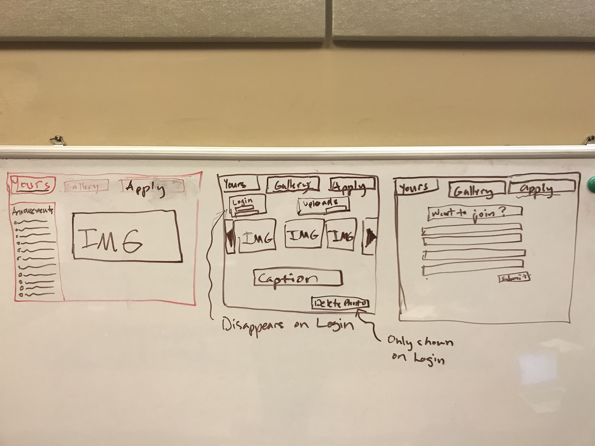

### Sketches for the Second draft of website
[Include sketches of your finalized design.]
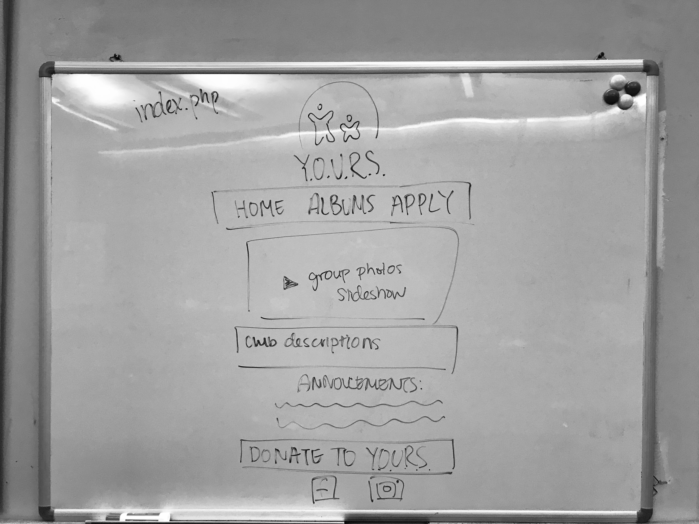
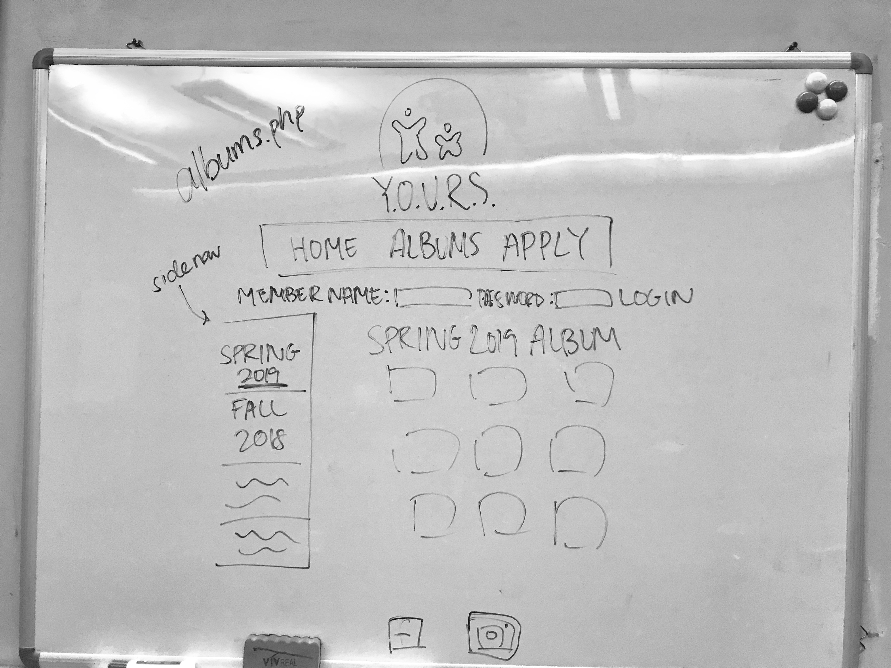
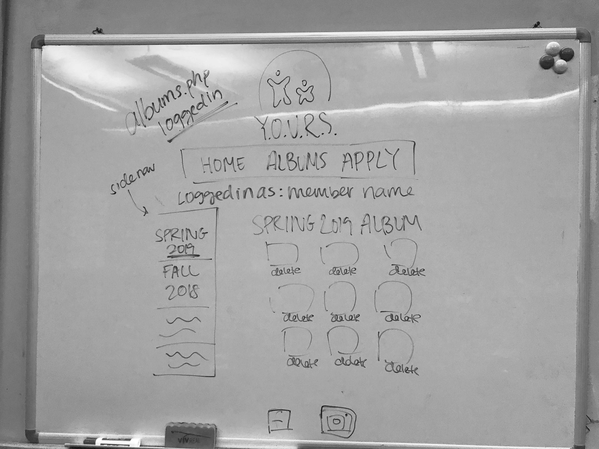
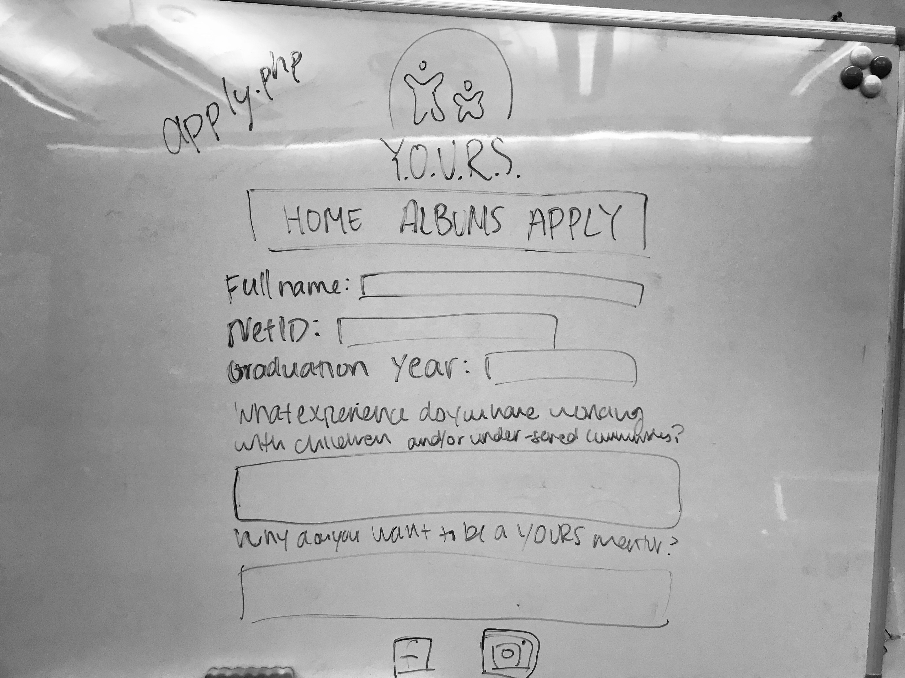

### MILESTONE 3 Draft Sketches (THESE ARE NOT FINAL):

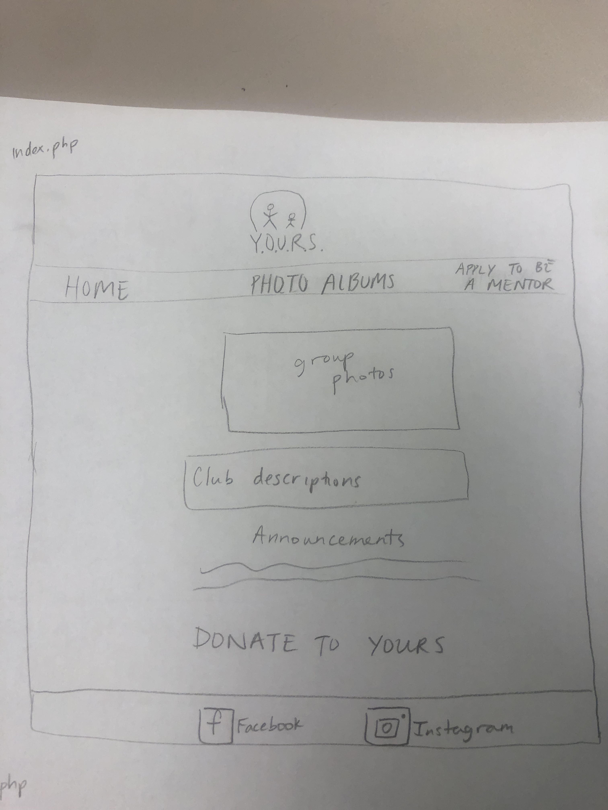
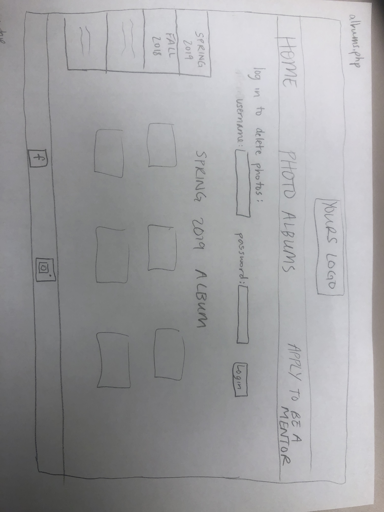
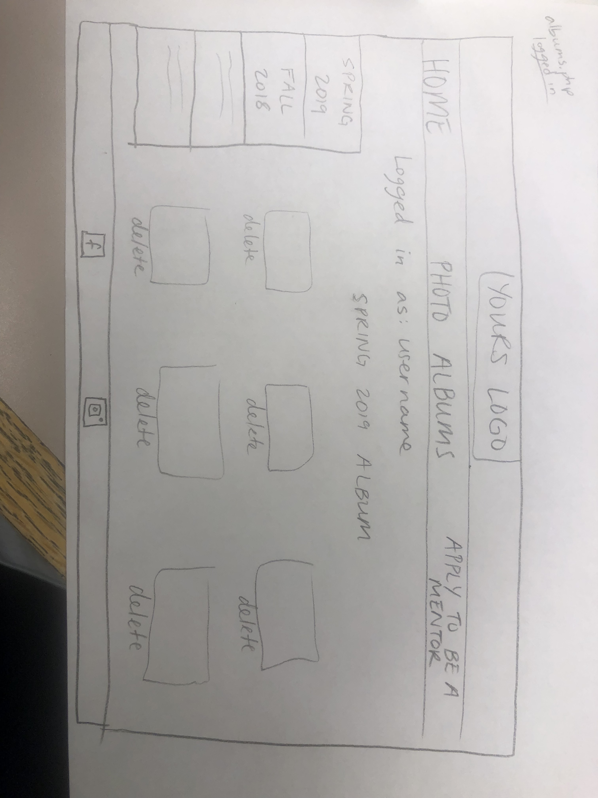
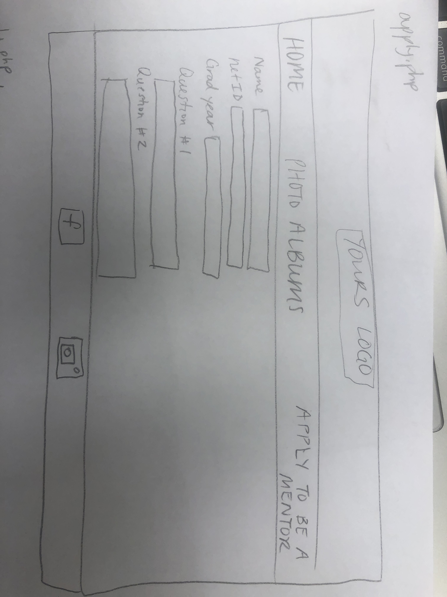
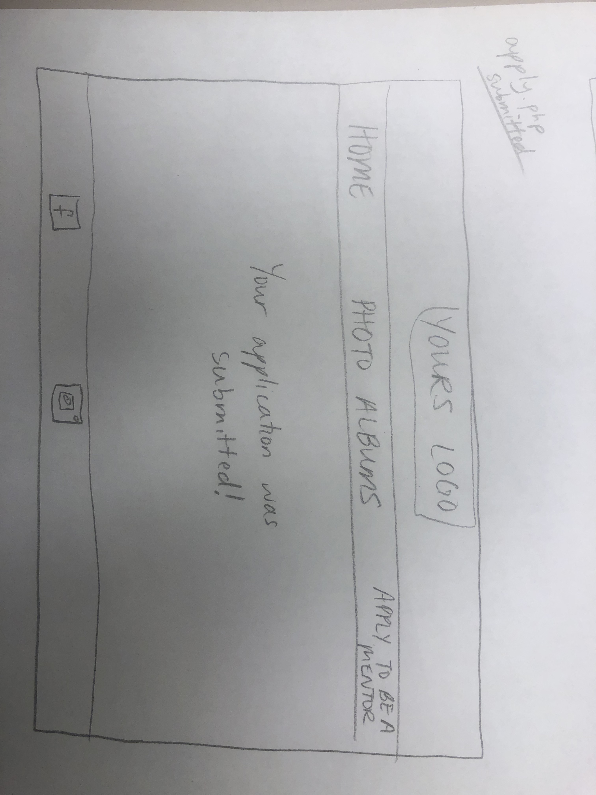

## Information Architecture, Content, and Navigation

- **Navigation**
  - Home
    - Annoucements
  - Albums
    - Multiple Photo Albums
    - Delete/Upload Photo Forms
    - Form to add an album
  - Apply
    - Form to apply to be a mentor
    - Form feedback to view submission
    - A table for users to see who has applied to be a mentor
  - Comments
    - Form to Provide suggestion/comment
    - Table to look through previously submitted suggestions
    - Search suggestion/comment table
  - Login

- **Content**
  - *Home*: List the current annoucements for the club, include information about club description and a brief overview of the work that they do, include crowdfunding info (with a redirect to thier fundraising page);
  - *Album*: highlight photos in an interactive photo album;
    - side bar to indicate what album user is currently viewing.
    - *delete/upload options*: if a member is logged into the website provide delete photo and upload photo options.
  - *Apply*: This will be an application form for those people who want to join the club next semester;
  - *Feedback*: Form to input suggestion/comment. Search bar to search through existing suggestions/comments;
  - *Login*: have a login option for current members to sign into the website;

- **Process**
  - Our card sort
  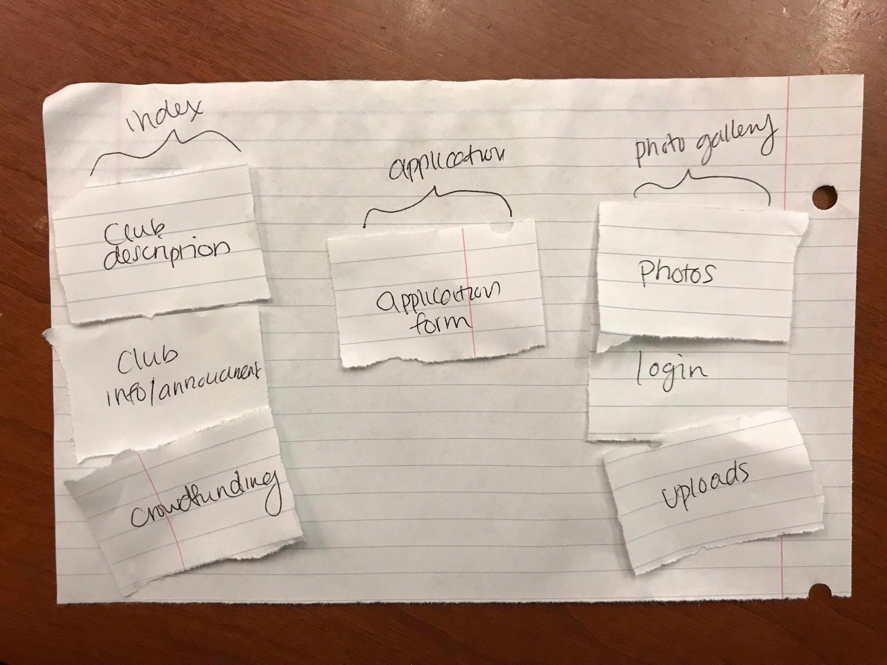
  - We chose to sort the content in the most logical manner. We thought that all the about info about the club, including crowdfunding should be put together on the first page when you open it so that you could get a better idea about what YOURS is. All the photos should be on one photo gallery page. (This is where we would also include the login of members - these members would have the option to delete photos/upload photos) The application form would go on it's own separate page. This is because it is meant for prospective members.


## Interactivity

- A login feature for members of the organization.
- Upload or delete images (if you are a logged in member)
- Add album (if you are a logged in member)
- Add a suggestion/comment
- Search for suggestions/comments
- Add a program (if you are a logged in member)
- Add announcement (if you are a logged in member)
- Delete announcement (if you are a logged in member)
- Submit application
- View submitted applications (if you are a logged in member)
- View announcements
- Nav bar dynamically with PHP.
- Side photo bar (indicate album name)

After client meetings and feedback from initial design, we made some changes to our interactivity.
- We want to implement a suggestions/comments page to implement more interactivity with the users and to provide program feedback - this can ensure that the program can improve.
- Based on client suggestions, there will now be photo albums seperated by school year semesters.
- The links to different albums will be on the left side, as a sidebar. The sidebar will be sticky, and will follow the user as the user scrolls down through images. To view images for another semester, the user will have to click on the specific link for it.
- These links are also built via http build query and GET fields. Based on the GET fields, we will take the corresponding data from our SQL database.


### How the interactivity connects with the needs of the clients/target audience:

The audience needs to be able to login to be able to upload and delete images. There is a photo slideshow on the home page, where the audience can click on buttons to go to the next image or previous image. Our client's images are sorted by semesters and years. Users that were in the events will also want to see which images they were in, and these users will mostly remember by the semester or year they were part of the event.

## Work Distribution

[Describe how each of your responsibilities will be distributed among your group members.]

[Set internal deadlines. Determine your internal dependencies. Whose task needs to be completed first in order for another person's task to be relevant? Be specific in your task descriptions so that everyone knows what needs to be done and can track the progress effectively. Consider how much time will be needed to review and integrate each other's work. Most of all, make sure that tasks are balanced across the team.]

Before the next deadline, we will create rough drafts of each of the pages. Nakia will do apply.php, Sam will do image.php, Rishab will do albums.php, and Destiny will do index.php. All of us will then reconvene to discuss all of the needs for each of the pages and assist each other where needed. We will plan to meet again next Sunday April 20th. We will discuss frequently in our group chat to make sure that everyone is up to speed with the progress of our project.

## Additional Comments

[If you feel like you haven't fully explained your design choices, or if you want to explain some other functions in your site (such as special design decisions that might not meet the final project requirements), you can use this space to justify your design choices or ask other questions about the project and process.]


--- <!-- ^^^ Milestone 1; vvv Milestone 2 -->

## Client Feedback

Feedback from client on initial site design.
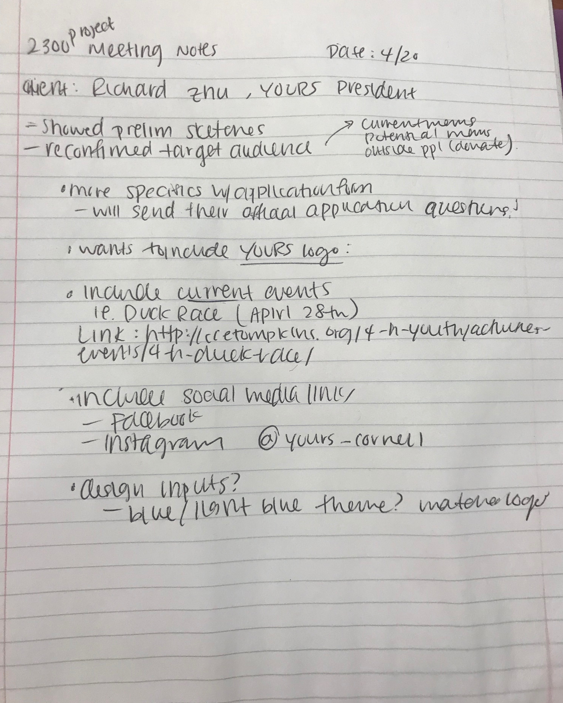

## Iterated Design

We improved a few features of our design. We made the application form more specific so that our client could see how the form would visually look. We will include current events in the annoucement section on the home page. To really highlight photos we decided to include a slideshow in the home page, to emphasize visual appeal. Additionally, we will include a footer.php to link to YOURS social media accounts. We added the yours logo to the includes header so that the logo would be featured on every page. To match the color scheme of the logo, the website theme will be blue/light blue.

## Evaluate your Design

We've selected **[Abby]** as our persona.

We've selected Abby as our persona because most Cornell students are really familiar with using technology and forms, so we want to elimiate the assumption that everyone who is on our website is very tech savy. Abby has low confidence when figuring out new computing tasks and is risk adverse to unfamiliar technology. We want to account for all types of users and address the gender bias within our website.

### Tasks

Task 1: Delete a Photo from Spring 2019 Album

- Subgoal 1: Login
  1. Navigate to the albums page
  2. Enter name and password and click login
- Subgoal 2: Find Album and Delete Photo
  1. Use left side bar nav to find Spring 2019 album
  2. Locate image in Spring 2019 album and click delete under image

Task 2: Apply to be a mentor
  1. Find the apply tab on the nav bar, and click on it.
  2. Enter relevant details in the provided form.
  3. Click submit to apply.


### Cognitive Walkthrough

#### Task 1 - Cognitive Walkthrough

**Task name: Delete a Photo from Spring 2019 Album**

**Subgoal # 1 : Login**

  - Will Abby have formed this sub-goal as a step to their overall goal?
    - Yes, maybe or no: [maybe]
- Why?
    - Abby might have formed this subgoal given that she could imply that to make edits to official website pictures she has to be a member. However, it is not definitely a yes because there are no instructions on the website that explcitly mention a user must login to modify photos. Because Abby works best when technology is fully explained and layed out for her.

**Action # 1: Navigate to Albums Page**
  - Will Abby know what to do at this step?
    - Yes, maybe or no: [yes]
  - Why?
    - [Abby] will know that she needs to select the picture she wants to delete. Given that Abby is quite logical, she will know that to find a specific album, she has to first go to the Albums page with all of the photos.


  - If Abby does the right thing, will she know that she did the right thing, and is making progress towards her goal?
    - Yes, maybe or no: [yes]
  - Why?
    - Yes, although Abby doesn't have the best confidence when working with computers, it will be very clear once she lands on the albums page that this section of the website is where she will find the photos.

**Action # 2: Enter name and password and click login**
  - Will Abby know what to do at this step?
    - Yes, maybe or no: [maybe]
  - Why?
    - Again, [Abby] might know to login because of her logical skills, however it does not clearly state on the website that login is required for photo edits. Because Abby does not often engage in tinkering, she will not click around to figure out what features are necessary to modify photos and might blame herself for not knowing how to delete a photo.

  - If [Abby] does the right thing, will she know that she did the right thing, and is making progress towards her goal?
    - Yes, maybe or no: [yes]
  - Why?
    - Yes, if she does log in she will see the delete options on the photos and know that she is closering to deleting her photo. She doesn't have much time to waste, but because the delete option on the album are very clear she will know that she did the right thing.


**Subgoal # 2 : Find Album and Delete Photo**
  - Will Abby have formed this sub-goal as a step to their overall goal?
    - Yes, maybe or no: [yes]
  - Why?
    - Yes, [Abby] uses technology to solve tasks and once she is on the albums page, the side navigation bar should be familiar to her given she most likely has experience with nav bars. Because the task stated that she needed to delete from Spring 2019, she will know she has to find the specific albumn out of the ones listed.

**Action # 1: Use left side bar nav to find Spring 2019 album**
  - Will Abby know what to do at this step?
    - Yes, maybe or no: [yes]
  - Why?
    - It will be easy to navigate and hard to miss the nav because it is on the side of the page. [Abby] is comfortable with technology that she is used to using.

  - If Abby does the right thing, will she know that she did the right thing, and is making progress towards her goal?
    - Yes, maybe or no: [yes]
  - Why?
    - Once a certain semester is chosen, the heading of the semester will also chnage on top of the photos making it very easy to tell which semester album [Abby] is looking at. [Abby] does not have much time to waste, looking through photos to see if they are in the correct semester. It is apparent through the album title heading.

**Action # 2: Locate image in Spring 2019 album and click the delete button under image**
  - Will Abby know what to do at this step?
    - Yes, maybe or no: [maybe]
  - Why?
    - Using basic logic, [Abby] will know she has to pick one specific photo from the Spring 2019. Given that the delete option will be under every photo, she should know that clicking the delete button under an image will delete that given image. However, since it is not clearly instructed she might be slightly confused at first about the entire photo deleting process.

  - If Abby does the right thing, will she know that she did the right thing, and is making progress towards her goal?
    - Yes, maybe or no: [no]
  - Why?
    - There is no message stating that a specific photo has been deleted. Given that [Abby] has low confidence with unfamiliar computing tasks, she might blame herself for not deleting a photo correctly. She won't be able to tell if the photo has been removed.

#### Task 2 - Cognitive Walkthrough

 **Task name: Apply to be a mentor**

 **Subgoal #1 : Find the Application**

   - Will [Abby] have formed this sub-goal as a step to their overall goal?
     - Yes, maybe or no: [yes]
    - Why?
      - Abby wants to apply to be mentor. Any path towards becoming an mentor will involve going to the application page.

 **Action #1 : Click on Apply**

   - Will [Abby] know what to do at this step?
     - Yes, maybe or no: [maybe]
  - Why?
      - [Abby] is skilled enough to know how to navigate through simple pages, so she knows to look through the navigation bar, however, she may not know what the tab saying `apply` means.

   - If [Abby] does the right thing, will she know that she did the right thing, and is making progress towards her goal?
     - Yes, maybe or no: [yes]
    - Why?
      - The new page will have enough information as feedback to make Abby understand that she's on the right page to apply to be a mentor.

 **Action #2 : Submit an Application**

   - Will [Abby] know what to do at this step?
     - Yes, maybe or no: [yes]
    - Why?
      - Abby is skilled enough to read a form, insert answers, and press the submit button

   - If [Abby] does the right thing, will she know that she did the right thing, and is making progress towards her goal?
      - Yes, maybe or no: [maybe]
    - Why?
      - This depends on whether or not there will be feedback to tell her if her application was sent correctly or not.


 ### Cognitive Walk-through Results

 [Did you discover any issues with your design? What were they? How will you change your design to address the gender-inclusiveness bugs you discovered?]

 [Your responses here should be **very** thorough and thoughtful.]

 Results from Task 1:
  - We saw that the rules for who can delete a photo should be explicit, i.e. we should state that a user must be logged in to delete a photo.
  - There should be feedback shown when a photo is deleted so that the user knows that something happened.

 Results from Task 2:
   - The walkthrough showed a significant lack in clarity with our navigation bar. We decided to change the navigation link to apply.php to read `Apply to Be a Mentor` so that it is clear what a user is applying for. If it just read `Apply`, users would not understand if the link is to apply to be a mentor or to apply to be on the executive board of the club.
   - The wlakthrough showed we needed to be specific our form feedback. We will be making sure that the form on the `Apply to Be a Mentor` page is sticky and shows feedback about whether or not their application was submitted to the organization.


## Final Design


OFFICIAL FINAL DESIGN:
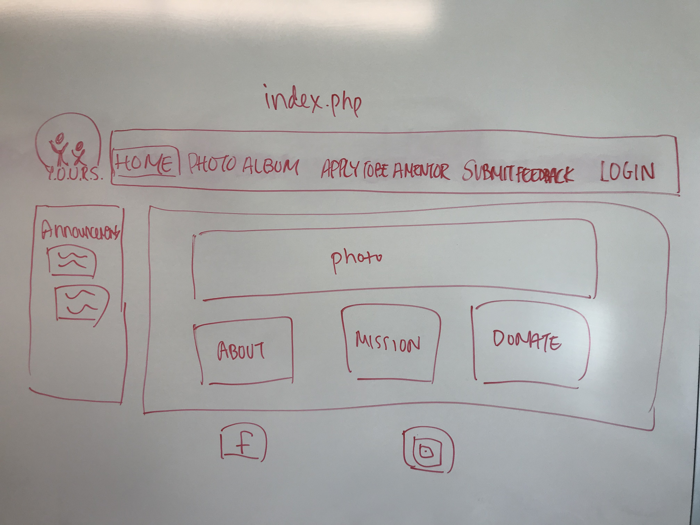
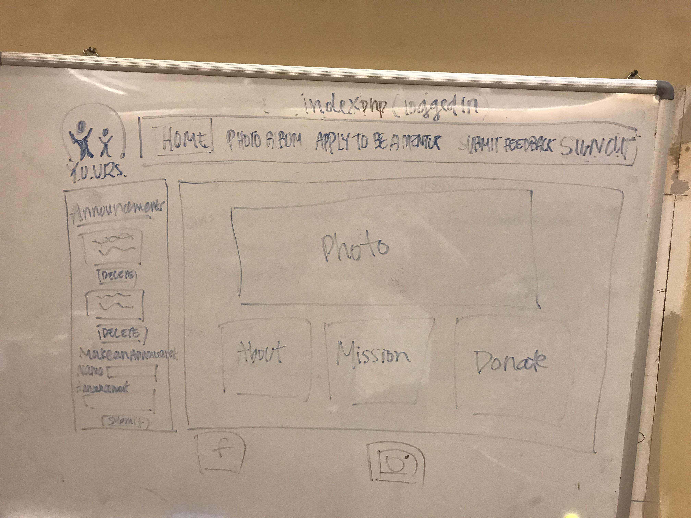
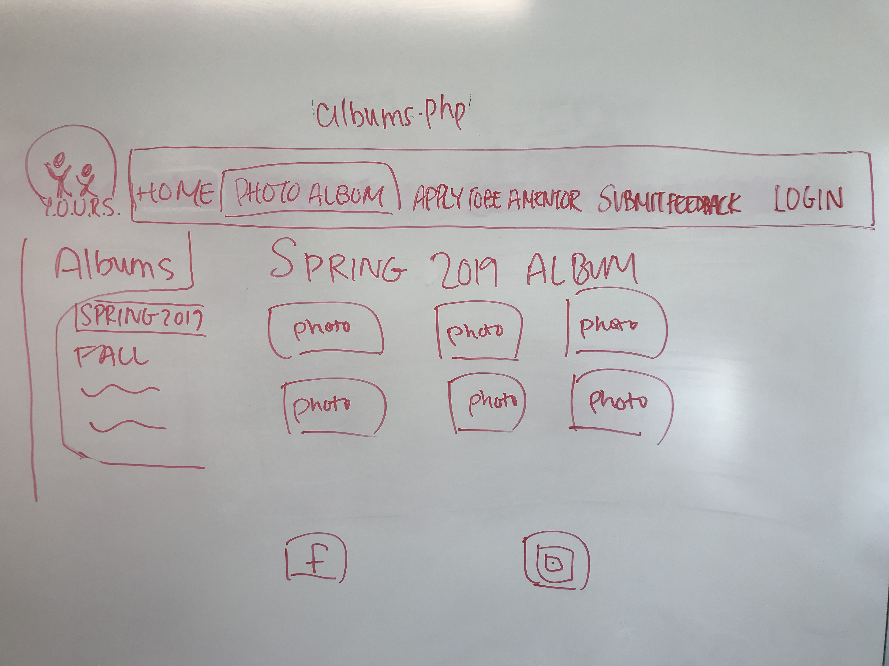
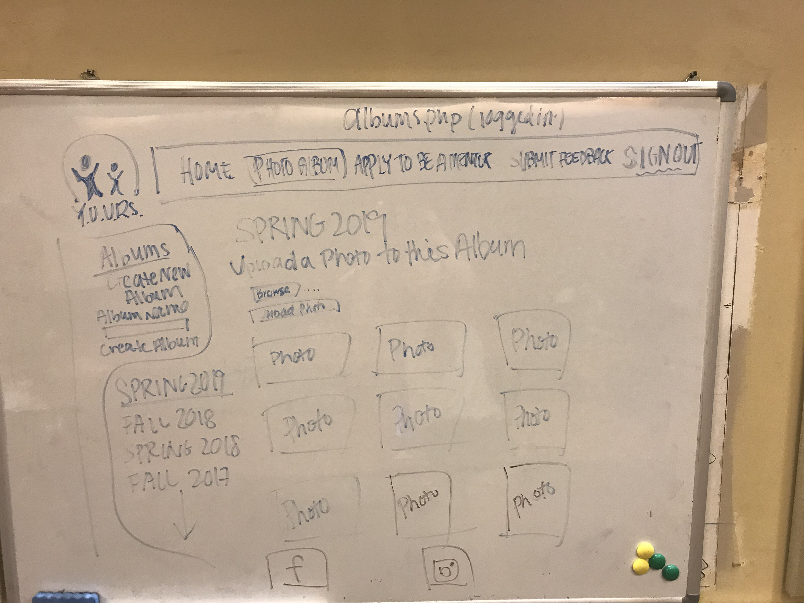
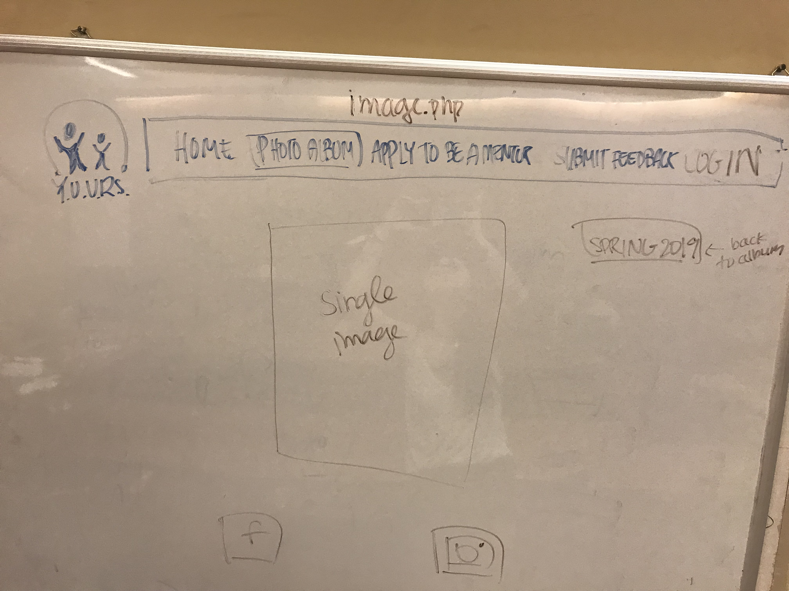
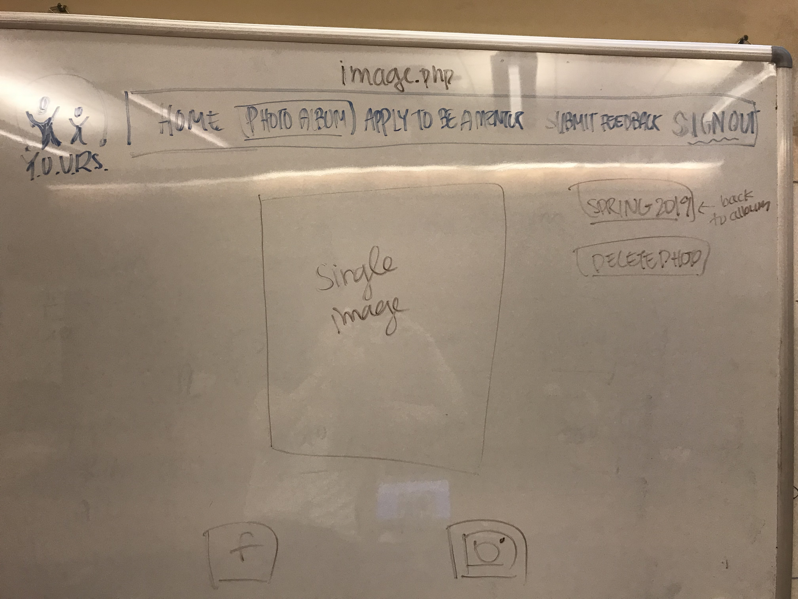
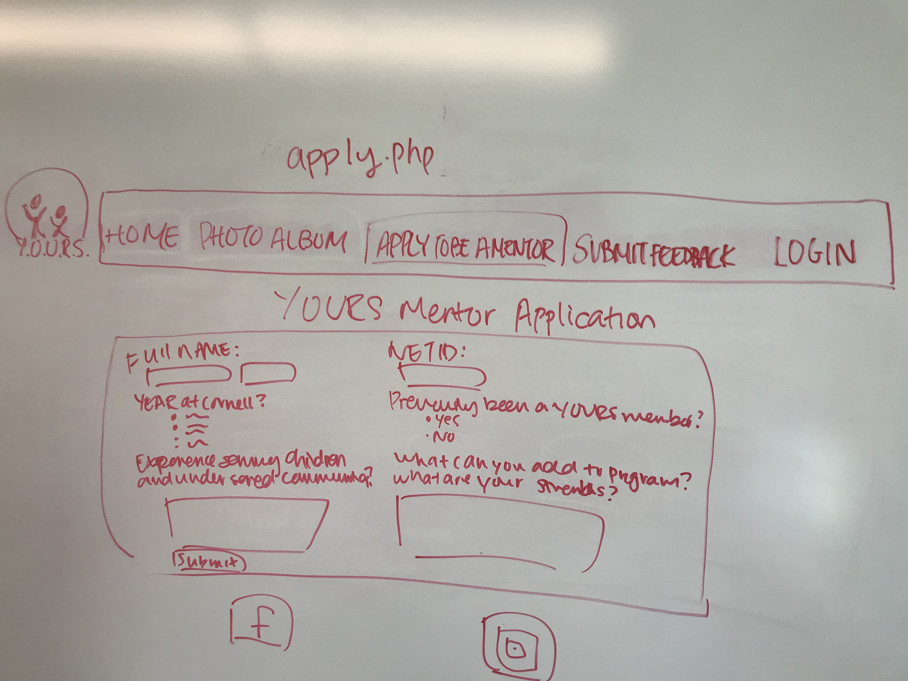
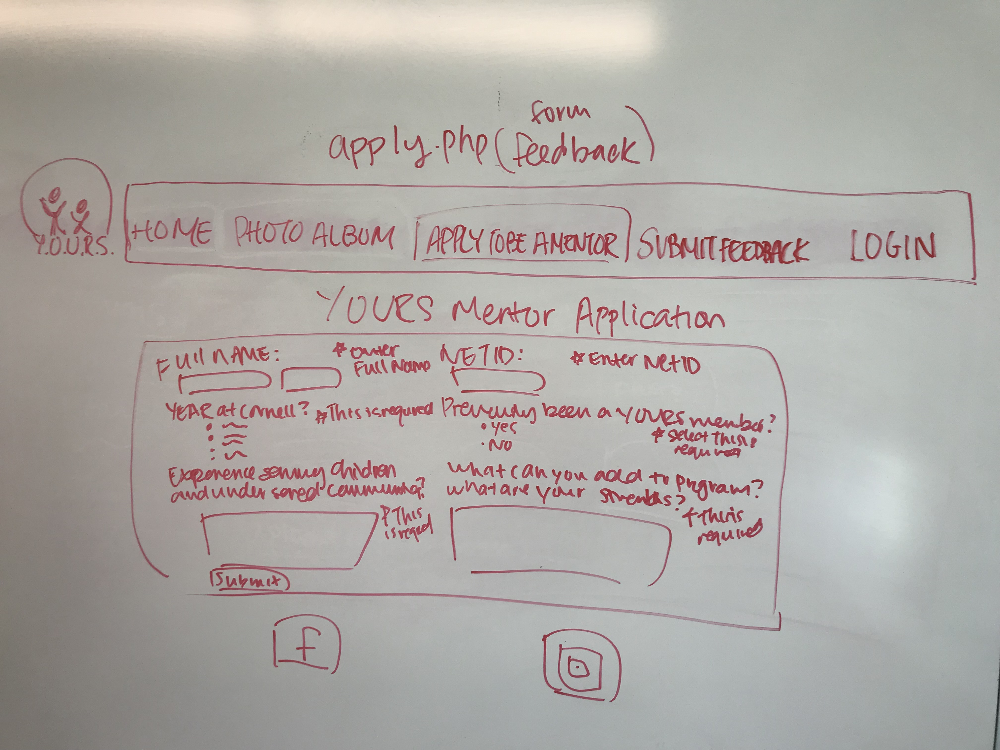
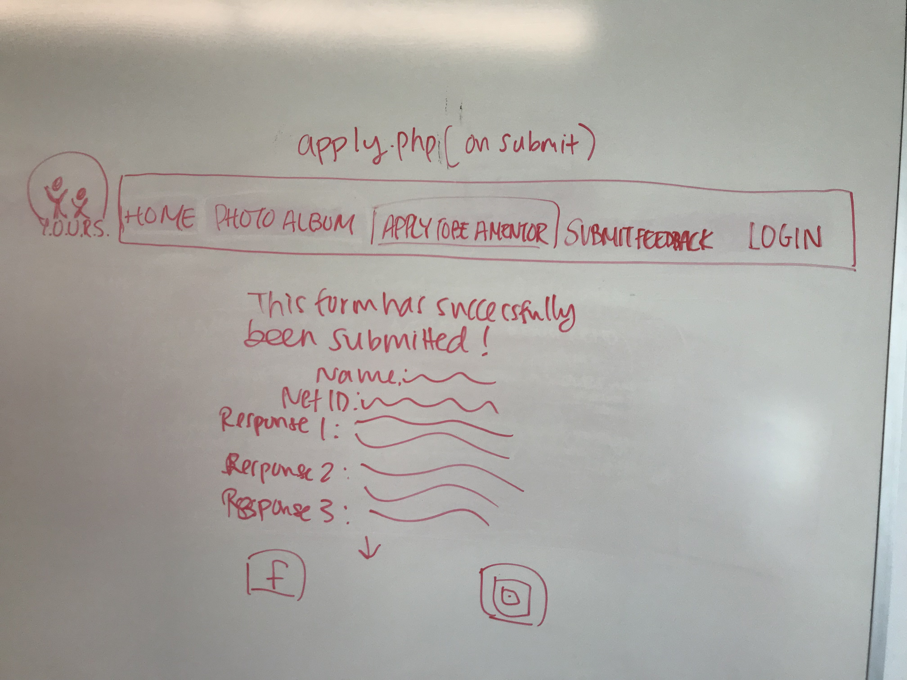
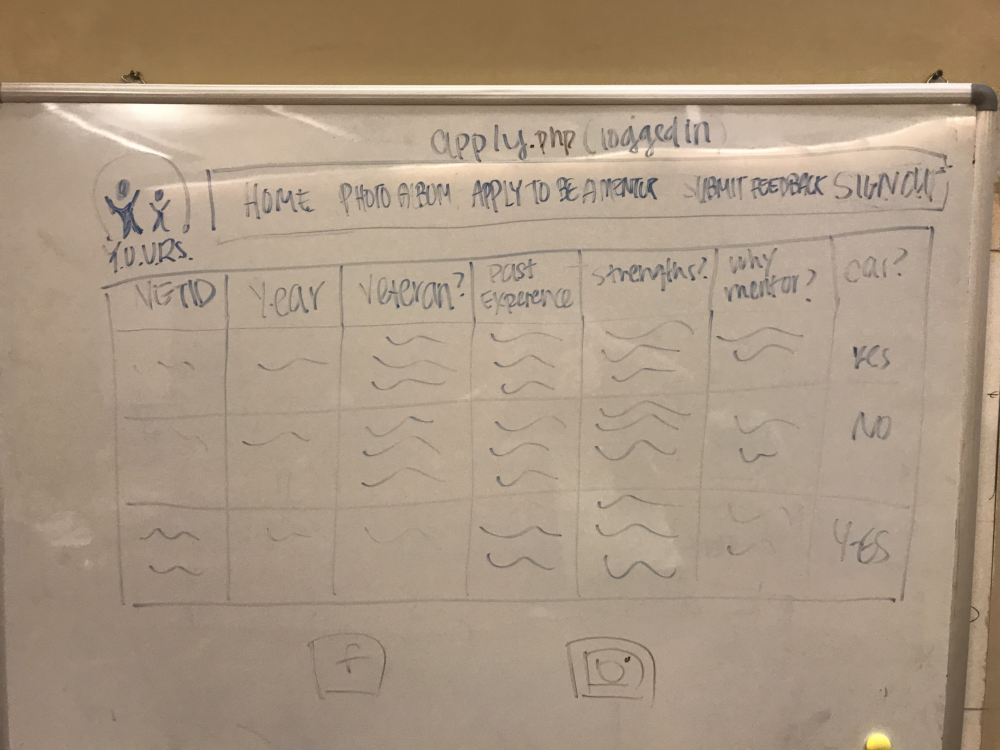
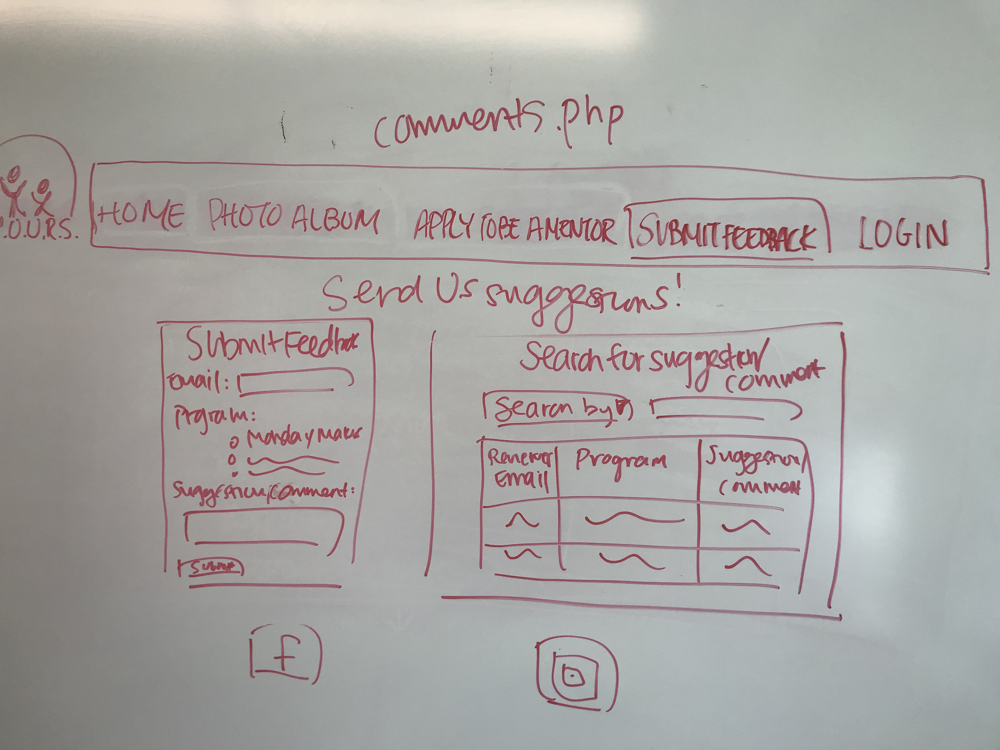
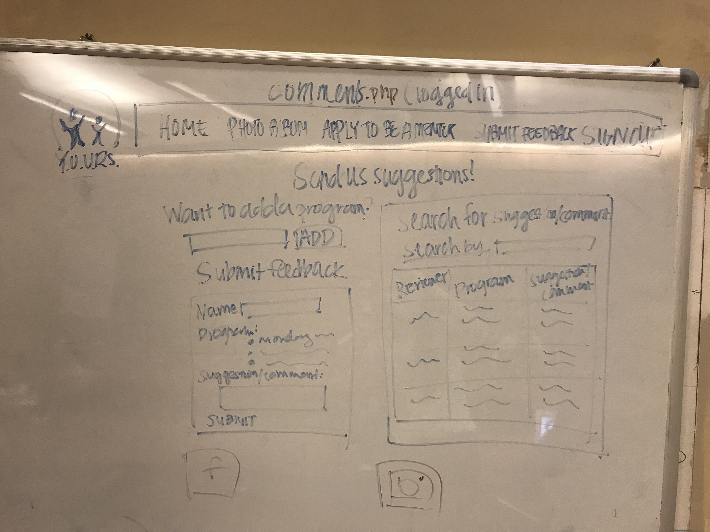
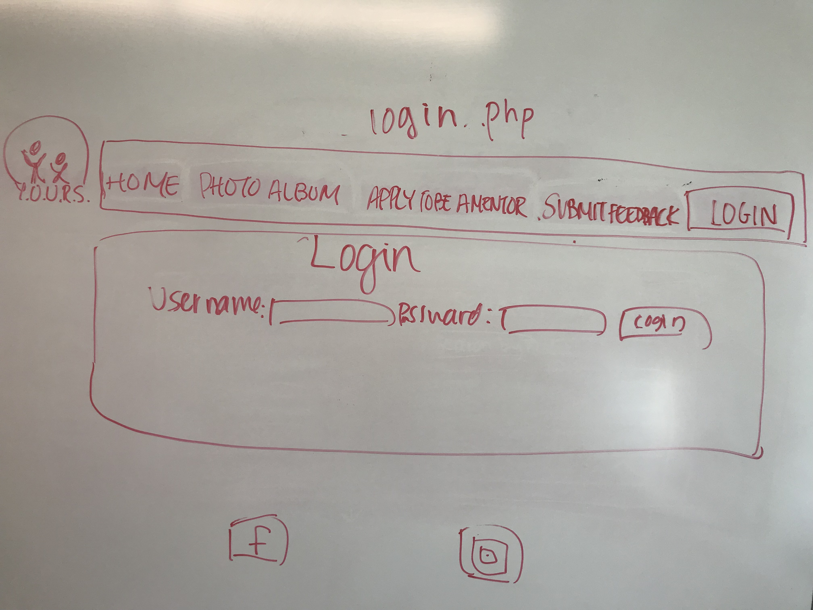


Based on feedback from our Cognitive Walkthrough, we updated the navigation bar on all pages, the submitted form page with a feedback message, and we added a header to let users know you must be logged in to delete photos. We wanted to ensure that our final design could be usable by everyone accessing the site. With a clear, organized final design all features of the side are easy to interact with.

## Database Schema

```
users (
  id: INTEGER {PK, U, Not, AI}
  username: TEXT {U, Not}
  password: TEXT {U, Not}
)
```

```
sessions (
  id: INTEGER (NOT NULL PRIMARY KEY AUTOINCREMENT UNIQUE)
  user_id: INTEGER (NOT NULL)
	session: TEXT (NOT NULL UNIQUE)
)
```

```
images (
  id: INTEGER {PK, U, Not, AI}
  file_name: TEXT {U, Not}
  file_ext: TEXT {Not}
)
```

```
albums (
  id: INTEGER {PK, U, Not, AI}
  album_name: TEXT {U, Not}
)
```

```
image_album (
  id: INTEGER {PK, U, Not, AI}
  image_id: INTEGER
  album_id: INTEGER
)
```

```
announcements (
  id: INTEGER {PK, U, Not, AI}
  name: TEXT (NOT NULL)
  announcement: TEXT (NOT NULL)
)
```
```
`mentor_apps` (
  `id` INTEGER NOT NULL PRIMARY KEY AUTOINCREMENT UNIQUE,
  `net_id` TEXT NOT NULL,
  `year` TEXT NOT NULL,
  `veteran` TEXT NOT NULL,
  `experience` TEXT NOT NULL,
  `strengths` TEXT NOT NULL,
  `why` TEXT NOT NULL,
  `car` TEXT NOT NULL
);
```

```
`feedback` (
  `id` INTEGER NOT NULL PRIMARY KEY AUTOINCREMENT UNIQUE,
  `email` TEXT,
  `program` TEXT NOT NULL,
  `comment` TEXT NOT NULL
);
```

```
 `programs`(
  `id` INTEGER NOT NULL PRIMARY KEY AUTOINCREMENT UNIQUE,
  `name` TEXT NOT NULL UNIQUE
);
```

## Database Queries

We need queries to:

- Show all photos in a certain album

- Show one image

- See if a user has put in the right username and password

- To Upload a New Image (add image record and, if necessary, add what photo it is in)

- To Delete an Existing Image (delete image record)

- To Add Announcement

- To View Announcements

- Add program

## PHP File Structure

* index.php - main page
* includes/init.php - stuff that useful for every web page.
* includes/header.php - includes navigation
* includes/head.php - links for css and js
* includes/footer.php - links to social media accounts
* secure/init.sql - page for our seed data
* includes/upload_image.php - to include form to upload image
* albums.php - page that has all the images of the events
* apply.php - page that has form for prospective applicants
* login.php - includes login form
* image.php - includes single photo


## Pseudocode

### index.php

```
include init.php
include head.php
include header.php
 body
  Announcements, About, Donate
 body

 include footer.php
```

### albums.php
```
include init.php
include head.php
include header.php
include login.php
 body
SlideShow
Spring 2019  Album
body

 include footer.php
```
### apply.php
```
include init.php
include head.php
include header.php
body
 - Application form
body
footer.php

```
### login.php
```
include init.php
include head.php
include header.php
login code
include footer.php
```

### head.php
```
includes css link
includes js link
```
### header.php
```
includes logo
includes nav bar
```

### footer.php
```
includes links to social media accounts
```

### init.php functions needed
```
to determine if a user is logged in
to display all of the images in an album
to create the links with query string parameters to single images
to create the links with query string parameters to different albums
```

### image.php
```
include init.php
include head.php
include header.php
single photo
include footer.php
```

### upload_image.php
```
form that allows the user to upload an image
```

## Additional Comments

[Add any additional comments you have here.]


--- <!-- ^^^ Milestone 2; vvv Milestone 3 -->

## Issues & Challenges of Milestone 3

- challenges with implementating accurate feedback for the mentor application
- implementating a simple yet aesthetically pleasing theme with the correct color scheme
- figure out the slideshow on index.php
- search features in the feedback form
- upload photo feature, that adds directly to the album that you are adding to
- finding ways to add more interactivity

--- <!-- ^^^ Milestone 3; vvv FINAL SUBMISSION-->

## Final Notes to the Clients

[Include any other information that your client needs to know about your final website design. For example, what client wants or needs were unable to be realized in your final product? Why were you unable to meet those wants/needs?]
We were able to meet all needs discussed at our meetings. Because of the timeline of the project, we were not able to upload all images to the site but we have a fair amount from many different events.

## Final Notes to the Graders

[1. Give us three specific strengths of your site that sets it apart from the previous website of the client (if applicable) and/or from other websites. Think of this as your chance to argue for the things you did really well.]

- *note* YOURS did not have a previous website, but had a facebook and instagram account.

- One of our website strengths is the aesthetic yet simple theme. With focus on the light blue that is found in the loco we created a website that is both attractive yet easy to navigate. The blue tones are easy on the eyes and comfortable to look at. Given that a large part of our target audience may be students, we choose to make the website design minimalistic as those in our age cohort are used to. We wanted to ensure that the site would be easy to navigate, so we made our design welcoming rather than overwhelming or intimidating. This site does a better job of organizing information compared to current resources.

- Another one of our website strengths is the the amount of interactivity on each page. The structure of our site allows users to interact with content on every page, which appeals to all 3 of our target audiences (members/potential members/community members interested in the work). Regarding the current resouces to find information about YOURS on, there is not much interactivity. You can view the content but users are not fully able to interact with it. This site greatly improves users interaction with content to learn more about/inquire/suggest about YOURS.

- Our login function in particular sets the site apart from current resources. When logged into facebook/instagram, even if you are a member of yours, you do not have special features available to contribute to the accounts. Only the individual running the facebook/instagram has the ability to upload photos and post. This website gives members the priviledge and opportunity to feel like valued contributing members to the clubs. Their needs can be better heard and addressed.

[2. Tell us about things that don't work, what you wanted to implement, or what you would do if you keep working with the client in the future. Give justifications.]

- We originally would have wanted to implement a working slide show on the home page of ourwebsite. However, given scope limitations we were not able to do so. (For example, could not use start_session().) If we kept working with the client beyond the scope of this class in the future we would be able to create this slide show.

- Additionally, towards the end of finishing up our project we thought it might be interesting to possibly introduce an additional target audience and implement info for the kids in the program to look at. The mentees from program might be interested in seeing pics of themselves and their college mentors; so, we could also gear our design to reach children and ensure our the site is usable for them. We could work with the client and suggest this to see if he would want this to be an option.

- We acknowledge that there are not many INNER JOIN sql queries that utilize the intersection of our datasets. For the needs of our current website there were not many opportunities to use data from multiple tables. In the future we would love to discuss more complex visual/content display that could address this and go one step beyond what our client has currently asked us for.

[3. Tell us anything else you need us to know for when we're looking at the project.]
- Nothing else! We all had a great time working on this project and hope you enjoy the site as well !!
